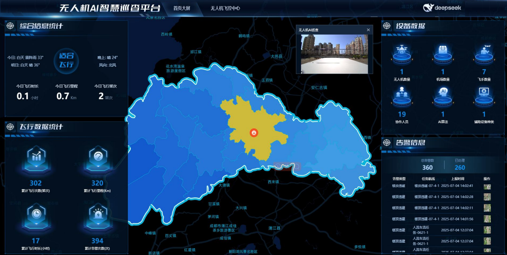
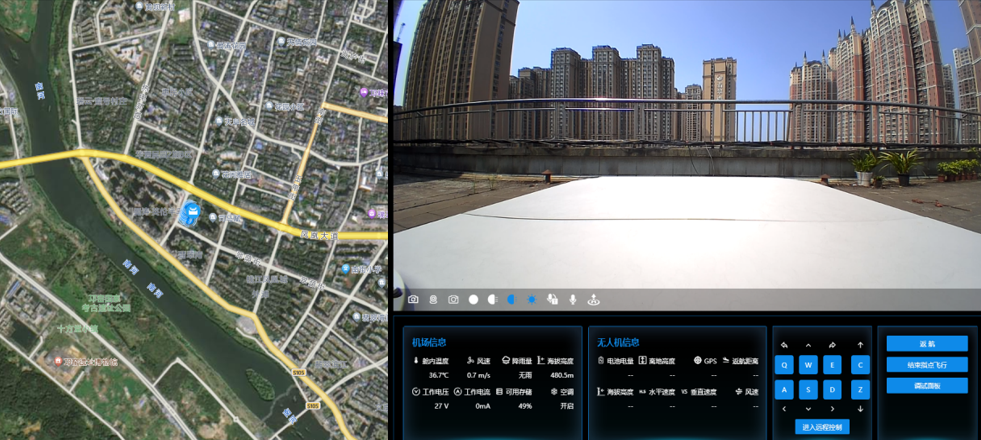
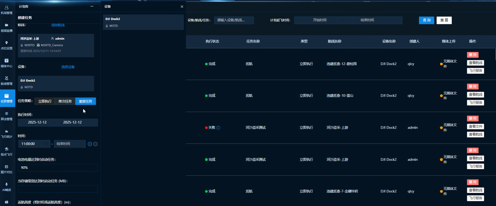
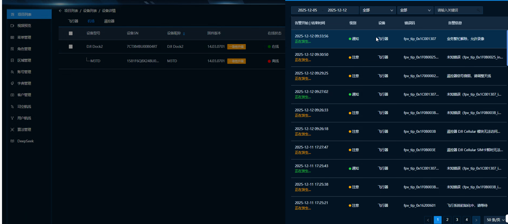
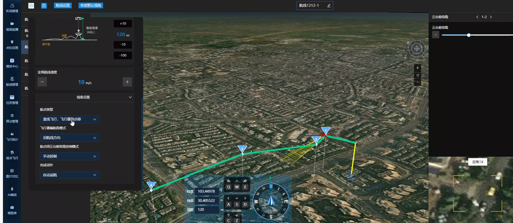
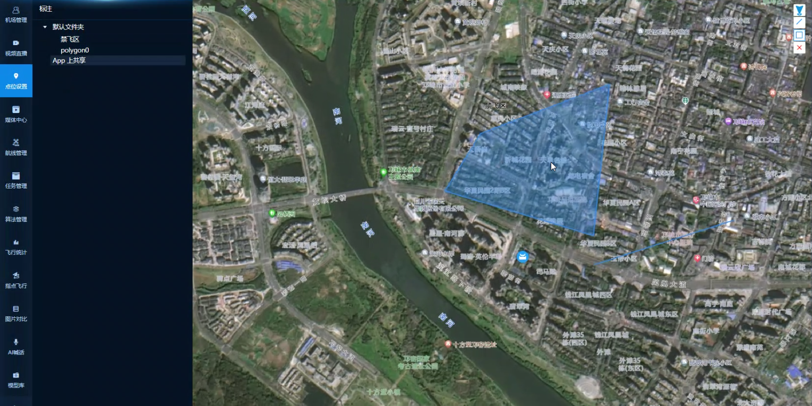
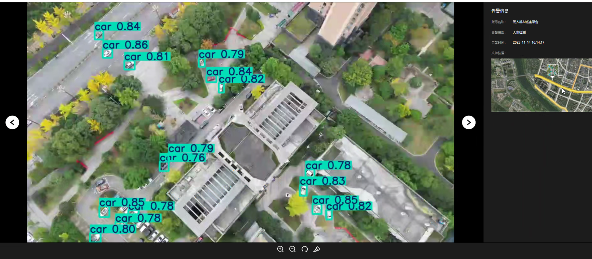
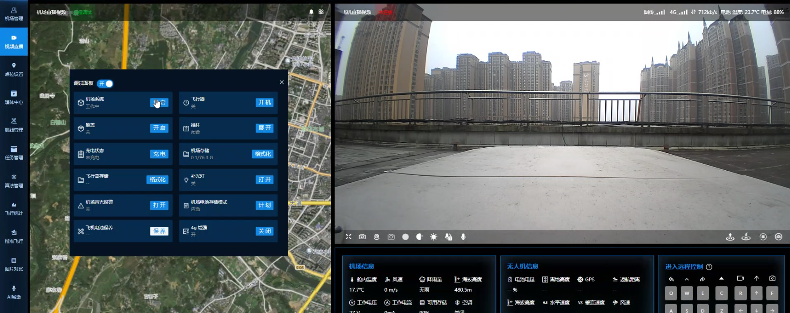
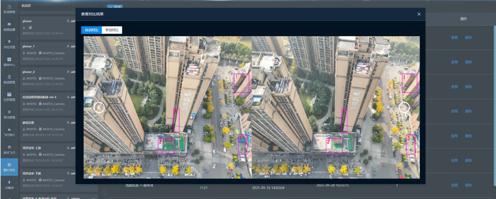
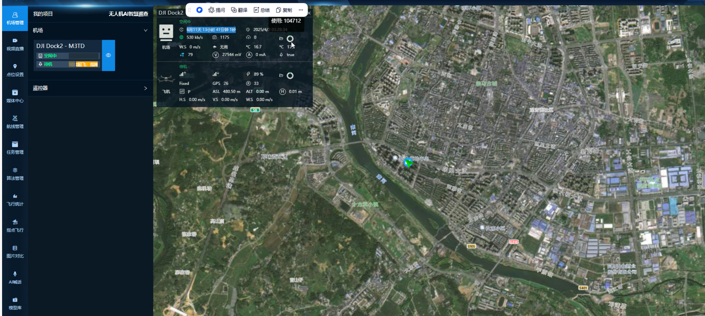

中文 | [English](./README.en.md)

无人机AI智能巡检系统
===============

当前最新版本： 1.3.31（发布日期：2025-12-01） 

项目介绍
-----------------------------------

<h3 align="center">无人机AI智能巡检系统</h3>

无人机AI巡检系统，包含3套软件系统：1、巡检系统（支持小程序端）。2、AI算法训练平台。3、飞行控制中台系统。

通过实时监控与智能调度，让低空安全管理稳如磐石。米级精准定位，让无人机飞行轨迹一目了然，电量、速度等状态也尽在实时掌控之中。适配大疆 、道通、黑鲨等主流机型。

支持接入DeepSeek本地化模型，其AI巡检系统更是亮点十足，能自动识别违规飞行，闯入禁飞区立即预警，为安全飞行保驾护航。

适用场景
-----------------------------------
        
#### 一个平台

1、规划：在地图上轻松划定电力线路、高速公路的巡检范围。
2、调度：统一管理上百条自动任务，能源管线巡查从此无人操心。
3、管理：所有告警和飞行数据集中呈现，自动生成报告。
        
#### 常用功能

1、环保：高效河道排污口排查，自动监控。
2、安防：日常消防通道占用检测，消除隐患。
3、能源：定期光伏板热斑检测，保障收益。
4、应急：快速执行洪涝灾害现场勘查。

#### 两大核心

1、自动巡检：无需飞手。一键设定光伏电站巡检或电网巡查等航线，无人机就能定时、自动完成作业，24小时待命。
        
2、AI识别：比人眼更准。自动识别河道排污、森林火点、工地安全违章等问题，并立刻告警，形成处理闭环，支持人车跟踪识别，远距离变焦处理等。
        
#### 四点价值

✅ 效率飙升：比人工巡检快5倍以上，成本大降。

✅ 安全省心：彻底避免人员进入高危区域的风险。

✅ 精准可靠：AI7×24小时不知疲倦，识别率超98%。

✅ 一机多用：换条航线就是新场景，投资回报率高。

解决方案
-----------------------------------

在城市，可帮助无人机避开航班、拍路况、助疏导；应急时，快速调度无人机协同救援；在农村，优化物流航线，解决配送最后一公里难题。解决传统人工巡检在电力、河道、林场等场景中，长期受困于 “效率低、风险高、数据散”—— 高压线路需登塔作业，山区林区存在巡护盲区，管道泄漏排查等。

- 无人机巡检系统之智能道路巡检：  [无人机巡检系统之智能道路巡检](https://blog.csdn.net/xiaoyuner1349/article/details/156274306?spm=1001.2014.3001.5501) 

系统功能清单：
[无人机飞控平台功能清单.pdf](无人机飞控平台功能清单.pdf)

[视频AI算法平台功能清单.pdf](视频AI算法平台功能清单.pdf)

[算法模型赠送清单.pdf](算法模型赠送清单.pdf)

技术架构：
-----------------------------------

#### 智慧巡查平台&飞控中心

- 后端源码(SpringBoot2.7.2 + Mysql8)
- Web端源码(Vue3+ElementUI)
- 小程序端源码(Uniapp)

#### 视频AI算法平台

- 后端源码(SpringBoot2.7.2 + Mysql8)
- Web端源码(Vue3+ElementUI)

### 系统界面（部分）

飞控平台

自动化巡任务检配置

飞行实时视频

多项目场景管理

航点行为配置

设置禁飞区

视频算法标注处理与预警

算法模型配置

无人机参数调试

图片算法比对与预警

机场管理

### 联系我们

需要咨询业务合作或商业版代码，可扫码联系：VX：xiaoyuner1349

